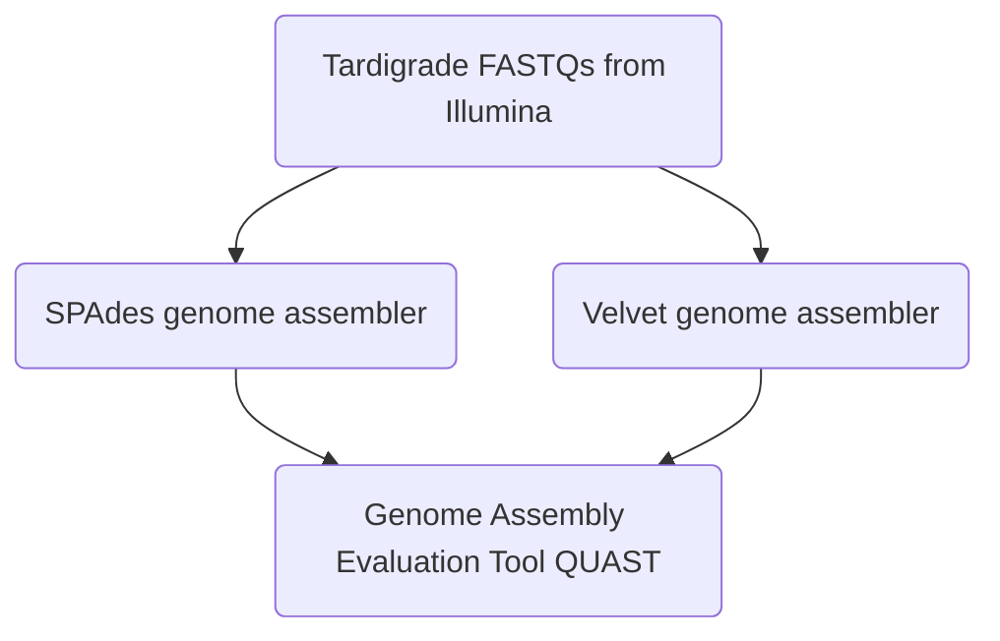

# SEABEARS


## BACKGROUND
For this project, we are comparing the genome assembly of _Hypsibius dujardini_ (tardigrade, aka sea bears) between two different assembling programs through conda. We are following a previous study which used SPAdes as the de novo genome assembler. The assembler we will be comparing to SPAdes is Velvet. Both SPAdes and Velvet are de novo genome assemblers most often used for small genomes and takes paired-ends reads in FASTQ formatting. Velvet was inititally released in 2008, while SPAdes is much newer, having been fully released in 2021. 

### ORGANISM BACKGROUND
Tardigrades (a.k.a. water bears or moss piglets)
- Invertebrates belonging to the phylum Tardigrada
- Close relative to arthropods
- Large number of genera and species
- Variety of habitats: damp moss, sand, fresh or salt water


## METHODS
### General Pipeline
First, we will be using two separate _De novo_ genome assemblers called Canu and SPAdes. We are inputting the same Tardigrade forward and reverse reads into each system. Once we have both genome assemblies, we will be using the genome assembly evaluation tool (QUAST) to determine the quality of each assembly from the two separate pipelines.  


### Commands we used

#### SPAdes
```
## Downloading SPAdes de novo genome assembler
conda install -c bioconda spades

## Downloading reads for assembly programs
curl -L -o forwardreads.fastq.bz2 https://ddbj.nig.ac.jp/public/ddbj_database/dra/fastq/DRA004/DRA004455/DRX049724/DRR055040_1.fastq.bz2
curl -L -o reversereads.fastq.bz2 https://ddbj.nig.ac.jp/public/ddbj_database/dra/fastq/DRA004/DRA004455/DRX049724/DRR055040_2.fastq.bz2

## Converting bz2 to gz for assembly program use
bzcat forwardreads.fastq.bz2 | gzip -c >forwardreads.fastq.gz
bzcat reversereads.fastq.bz2 | gzip -c >reversereads.fastq.gz

## Trim reads for program
trimmomatic PE forwardreads.fastq.gz reversereads.fastq.gz \
    forwardreads.trimmed.fastq.gz forwardreadsun.trimmed.fastq.gz \
    reversereads.trimmed.fastq.gz reversereadsun.trimmed.fastq.gz \
    SLIDINGWINDOW:4:20 -phred33
    
## Running SPAdes program on reads
spades.py -1 forwardreads.trimmed.fastq.gz -2 reversereads.trimmed.fastq.gz -o SPAdesoutput --isolate

```
#### Velvet
```
## Downloading Velvet de novo genome assembler


## Downloading reads for assembly programs
curl -L -o forwardreads.fastq.bz2 https://ddbj.nig.ac.jp/public/ddbj_database/dra/fastq/DRA004/DRA004455/DRX049724/DRR055040_1.fastq.bz2
curl -L -o reversereads.fastq.bz2 https://ddbj.nig.ac.jp/public/ddbj_database/dra/fastq/DRA004/DRA004455/DRX049724/DRR055040_2.fastq.bz2

## Converting bz2 to gz for assembly program use
bzcat forwardreads.fastq.bz2 | gzip -c >forwardreads.fastq.gz
bzcat reversereads.fastq.bz2 | gzip -c >reversereads.fastq.gz

## Trim reads for program
trimmomatic PE forwardreads.fastq.gz reversereads.fastq.gz \
    forwardreads.trimmed.fastq.gz forwardreadsun.trimmed.fastq.gz \
    reversereads.trimmed.fastq.gz reversereadsun.trimmed.fastq.gz \
    SLIDINGWINDOW:4:20 -phred33
    
## Running Velvet program on reads

```

### QUAST
```
## Installing environment for QUAST
conda create -n quast-env python=3.6
conda activate quast-env

## Running QUAST on SPAdes output
quast.py -o quastoutput contigs.fasta

## Running QUAST on Velvet output

```

## RESULTS


## CONCLUSION
### SPAdes
SPAdes is not allowing two fastq files with different lengths to be run together on the program. The next ideas will be:

- Trimming the forward read (which is longer)
- Finding a way to override this error
- Assembling the forward and reverse reads individually

### Velvet
Using the forward read alone in Canu yielded no results. Trouble shooting options:

- Retrying forward read with different combinations of options/different command
- Downloading a new program entirely--some options we have looked into are PANDAseq and Velvet (Velvet seems more promising)


downloading files: 

https://en.wikipedia.org/wiki/De_novo_sequence_assemblers
https://canu.readthedocs.io/en/latest/quick-start.html
https://canu.readthedocs.io/en/latest/tutorial.html#tutorial
https://anaconda.org/bioconda/canu
