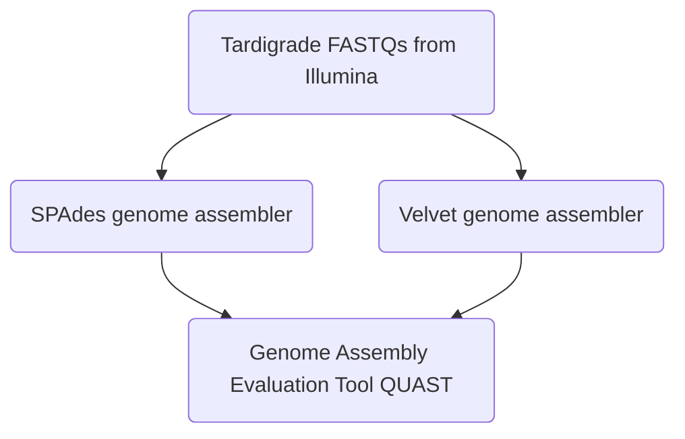

# SEABEARS


## BACKGROUND
For this project, we are comparing the genome assembly of _Hypsibius dujardini_ (tardigrade, aka sea bears) between two different assembling programs through conda. We are following a previous study which used SPAdes as the de novo genome assembler. The assembler we will be comparing to SPAdes is Velvet. Both SPAdes and Velvet are _de novo_ genome assemblers most often used for small genomes and takes paired-ends reads in FASTQ formatting. Velvet was inititally released in 2008, while SPAdes is much newer, having been fully released in 2021. 

### ORGANISM BACKGROUND
Tardigrades (a.k.a. water bears or moss piglets)
- Invertebrates belonging to the phylum Tardigrada
- Close relative to arthropods
- Large number of genera and species
- Variety of habitats: damp moss, sand, fresh or salt water


## METHODS
### General Pipeline
First, we will be using two separate _De novo_ genome assemblers called Velvet and SPAdes. We are inputting the same Tardigrade forward and reverse reads into each system. Once we have both genome assemblies, we will be using the genome assembly evaluation tool (QUAST) to determine the quality of each assembly from the two separate pipelines.  


### Commands we used

#### SPAdes
```
## Downloading SPAdes de novo genome assembler
conda install -c bioconda spades

## Downloading reads for assembly programs
curl -L -o forwardreads.fastq.bz2 https://ddbj.nig.ac.jp/public/ddbj_database/dra/fastq/DRA004/DRA004455/DRX049724/DRR055040_1.fastq.bz2
curl -L -o reversereads.fastq.bz2 https://ddbj.nig.ac.jp/public/ddbj_database/dra/fastq/DRA004/DRA004455/DRX049724/DRR055040_2.fastq.bz2

## Converting bz2 to gz for assembly program use
bzcat forwardreads.fastq.bz2 | gzip -c >forwardreads.fastq.gz
bzcat reversereads.fastq.bz2 | gzip -c >reversereads.fastq.gz

## Trim reads for program
trimmomatic PE forwardreads.fastq.gz reversereads.fastq.gz \
    forwardreads.trimmed.fastq.gz forwardreadsun.trimmed.fastq.gz \
    reversereads.trimmed.fastq.gz reversereadsun.trimmed.fastq.gz \
    SLIDINGWINDOW:4:20 -phred33
    
## Running SPAdes program on reads
spades.py -1 forwardreads.trimmed.fastq.gz -2 reversereads.trimmed.fastq.gz -o SPAdesoutput --isolate

```
#### Velvet
```
## Downloading Velvet de novo genome assembler
conda install -c bioconda velvet

## Downloading reads for assembly programs
curl -L -o forwardreads.fastq.bz2 https://ddbj.nig.ac.jp/public/ddbj_database/dra/fastq/DRA004/DRA004455/DRX049724/DRR055040_1.fastq.bz2
curl -L -o reversereads.fastq.bz2 https://ddbj.nig.ac.jp/public/ddbj_database/dra/fastq/DRA004/DRA004455/DRX049724/DRR055040_2.fastq.bz2

## Converting bz2 to gz for assembly program use
bzcat forwardreads.fastq.bz2 | gzip -c >forwardreads.fastq.gz
bzcat reversereads.fastq.bz2 | gzip -c >reversereads.fastq.gz

## Trim reads for program
trimmomatic PE forwardreads.fastq.gz reversereads.fastq.gz \
    forwardreads.trimmed.fastq.gz forwardreadsun.trimmed.fastq.gz \
    reversereads.trimmed.fastq.gz reversereadsun.trimmed.fastq.gz \
    SLIDINGWINDOW:4:20 -phred33
    
## Running Velvet program on reads
velveth velvet_assembly 51 -fastq -longPaired -separate forwardreads.trimmed.fastq.gz reversereads.trimmed.fastq.gz
velvetg velvet_assembly/ -min_contig_length 200

```

### QUAST
```
## Installing environment for QUAST
conda create -n quast-env python=3.6
conda activate quast-env

## Running QUAST on SPAdes output
quast.py -o quastoutput contigs.fasta

## Running QUAST on Velvet output
quast.py -o quastoutput2 contigs.fa
```

## RESULTS
### SPAdes
#### Contigs coverage histogram produced after running QUAST on the gnemome allignment produced using SPAdes


#### Frequency of different contig sizes after running QUAST on the gnemome allignment produced using SPAdes


#### GC content histogram for contigs produced using SPAdes genome allignment


#### GC content histogram for windows produced using SPAdes genome allignment


#### Cumulative contig length line graph produced after running QUAST on the gnemome allignment produced using SPAdes


#### Coverage histogram comparing contig coverage depth to coverage length based off of reads produced using SPAdes genome allignment


#### General Quality Assesment produced by QUAST based off of reads produced using SPAdes genome allignment


### Velvet

#### Contigs coverage histogram produced after running QUAST on the gnemome allignment produced using Velvet


#### Frequency of different contig sizes after running QUAST on the gnemome allignment produced using Velvet


#### GC content histogram for contigs produced using Velvet genome allignment


#### GC content histogram for windows produced using Velvet genome allignment


#### Cumulative contig length line graph produced after running QUAST on the gnemome allignment produced using Velvet


#### Coverage histogram comparing contig coverage depth to coverage length based off of reads produced using Velvet genome allignment


#### General Quality Assesment produced by QUAST based off of reads produced using Velvet genome allignment


## DISCUSSION

### Comparison of GC% found using QUAST on SPAdes and Velvet alignments as well as previously alligned genomes from NCBI database as reference

| Reference 1  |  Reference 2  | SPAdes |  Velvet |
| :---: | :---: | :---: | :---: |
| 45.3%  | 46.9% | 45.1%  | 45.7%  |

### Comparison of genome length(Mb) found using QUAST on SPAdes and Velvet alignments as well as previously alligned genomes from NCBI database as reference

| Reference 1  |  Reference 2  | SPAdes |  Velvet |
| :---: | :---: | :---: | :---: |
| 182.16  | 252.54 |  1164.47 | 217.49  | 

## CONCLUSION
Bioinformatics genome allignment technology has 
SPAdes


downloading files: 

https://en.wikipedia.org/wiki/De_novo_sequence_assemblers
https://canu.readthedocs.io/en/latest/quick-start.html
https://canu.readthedocs.io/en/latest/tutorial.html#tutorial
https://anaconda.org/bioconda/canu
